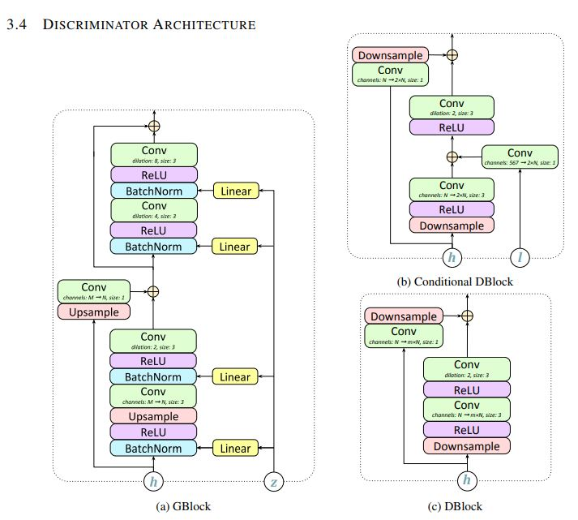

# GAN-TTS
A pytorch implementation of the GAN-TTS: HIGH FIDELITY SPEECH SYNTHESIS WITH ADVERSARIAL NETWORKS(https://arxiv.org/pdf/1909.11646.pdf)

## Prepare dataset
* Download dataset for training. This can be any wav files with sample rate 24000Hz.
* Edit configuration in utils/audio.py (hop_length must remain unchanged)
* Process data: python process.py --wav_dir="wavs" --output="data"

## Train & Tensorboard
* python train.py --input="data/train"
* tensorboard --logdir logdir

## Inference
* python generate.py --input="data/test"

## Result
* You can find the results in the samples directory.

## Attention
* I did not use the loss function mentioned in the paper. I modified the loss function and learn from ParallelWaveGAN(https://arxiv.org/pdf/1910.11480.pdf).

## Notes
* This is not official implementation, some details are not necessarily correct.
* The current results still have some noise, I suspect it is caused by the size of the batch.
* Work in progress.

## Reference
* kan-bayashi/ParallelWaveGAN(https://github.com/kan-bayashi/ParallelWaveGAN)
* Parallel WaveGAN(https://arxiv.org/pdf/1910.11480.pdf)
* GAN-TTS: HIGH FIDELITY SPEECH SYNTHESIS WITH ADVERSARIAL(https://arxiv.org/pdf/1909.11646.pdf)
